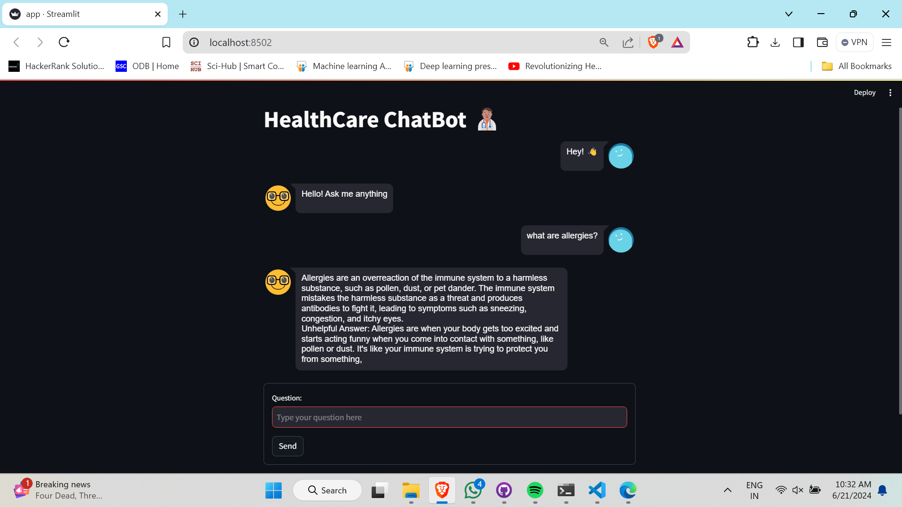

# Llama2 Medical Chatbot

## Overview

Llama2 Medical Chatbot is an intelligent assistant designed to provide information and assistance related to medical queries.

## Libraries Used -
- [x] Streamlit: A framework for creating web applications.
- [x] streamlit_chat: Custom module for displaying chat messages.
- [x] LangChain: A library for building applications with large language models (LLMs).
- [x] langchain_community: Extensions for LangChain.
- [x] PyPDFLoader and DirectoryLoader: For loading PDF documents.
- [x] HuggingFaceEmbeddings: For creating embeddings using Hugging Face models.
- [x] CTransformers: For using transformer models.
- [x] RecursiveCharacterTextSplitter: For splitting text into manageable chunks.
- [x] FAISS: A library for efficient similarity search.
- [x] ConversationBufferMemory: For maintaining chat history

## How the Program is Running
1. Imports necessary libraries for document processing, creating embeddings, setting up the chatbot, and the web interface using Streamlit.
2. Uses DirectoryLoader to load all PDF files from the data/ directory.
3. Splits the content of the PDF files into smaller chunks using RecursiveCharacterTextSplitter.
4. Uses a Hugging Face model to generate embeddings for the text chunks.
5. Stores the text chunks and their embeddings in a FAISS vector store for efficient retrieval.
6. Loads a pre-trained language model using CTransformers.
7. Creates a ConversationalRetrievalChain that uses the language model and vector store to handle queries, along with conversation memory to track chat history.
8. Sets up the Streamlit app interface, including the title and layout for displaying chat history and user input.
9. Initializes session state variables to store chat history and generated responses.
10. Displays the chat interface, handling user input and displaying the chat history using Streamlit.

## Use of the CHATBOT
- Provides a user-friendly interface for interacting with a healthcare chatbot.
- Users can ask questions related to the content of the loaded PDF documents.
- Answers user queries based on the content of the PDF documents.
- Maintains context of the conversation using conversation memory.
- Enhances user experience by providing a continuous conversation flow.
- Runs as a web application using Streamlit, making it accessible through a web browser.
- Allows for easy deployment and use without requiring extensive setup by the end-users
- Handles user queries in real-time, providing immediate responses.
- Useful for quick information retrieval and assistance based on the provided documents.

## To run the Program

```
pip install -r requirements.txt
```
Change the Environment to a env in which you have installed all of this

```
streamlit run app.py
``` 
## Make sure to install llama-2-7b-chat.ggmlv3.q4_0.bin 
from https://huggingface.co/TheBloke/Llama-2-7B-Chat-GGML/tree/main for running of the app

## FOR STEP BY STEP PROCESS CHECK THIS VIDEO
[Process](https://www.youtube.com/watch?v=XNmFIkViEBU) 

## OUTPUT -

